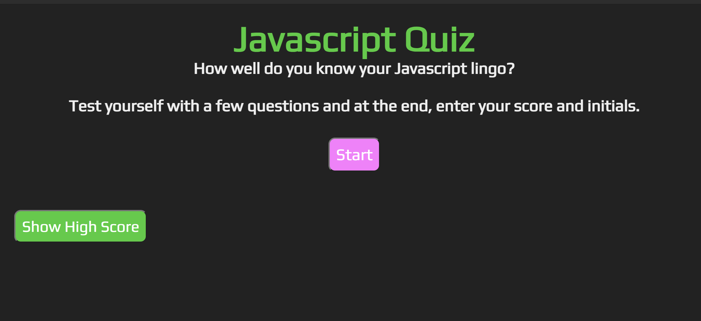

# Quiz-game

## Overview
The quiz game is an multiple choice questions and interactive coding challenges. 

The game utilizes a start button, which launches into a questionnaire. The timer will start once the "Let's start" button is clicked. There is an alert to notify the player if they answer the question correct or wrong. The questions will cycle through to the end of the game. At the end of the game there is a final prompt to enter your score and initials.

## Index

* Installation
* Built with
* Questions

## Installation:
 You can open this application by opening the HTML file with live server or default browser.

## Built with: 
  - HTML
  - CSS
  - JavaScript

https://dobinator.github.io/Quiz-game/

https://github.com/dobinator/Quiz-game

### Still of application:

